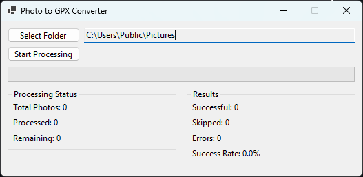

# GPX_From_Photos

A Windows desktop application written in C# (.NET 6) that converts photos with GPS EXIF metadata into GPX track files. The application scans folders recursively, extracts GPS coordinates from supported image formats, and generates standard GPX files with tracks for use in mapping applications, GPS devices, or other location-based services.



## Features

- **Recursive Folder Scanning**: Automatically searches through all subfolders
- **Multiple Image Format Support**: Handles JPG, JPEG, PNG, and HEIC files
- **GPS EXIF Extraction**: Uses MetadataExtractor library for reliable GPS data extraction
- **Real-time Progress Tracking**: Live updates on processing status with progress bar and success rate
- **Comprehensive Logging**: Detailed error logging for troubleshooting
- **Standard GPX Output**: Generates GPX 1.1 compliant files with tracks and track segments
- **Dual Point Generation**: Creates two track points per photo for enhanced mapping visualization
- **Non-blocking UI**: Asynchronous processing keeps the interface responsive

## Supported Image Formats

- `.jpg` / `.jpeg` - JPEG images
- `.png` - PNG images  
- `.heic` - HEIC/HEIF images (iOS devices)

## Requirements

### System Requirements
- **Operating System**: Windows 10 or later
- **.NET Runtime**: .NET 6.0 or newer
- **Memory**: Minimum 512MB RAM (2GB+ recommended for large photo collections)
- **Storage**: Sufficient space for output files and temporary processing

### Development Requirements
- **Visual Studio**: 2022 or later (Community edition is sufficient)
- **.NET SDK**: 6.0 or newer
- **NuGet Package Manager**: For dependency management

## Installation & Setup

### Download Pre-built Binary

1. Download the latest release from the GitHub releases page
2. Extract the ZIP file to your desired location
3. Run `GPX_From_Photos.exe`

## Usage Instructions

### Basic Workflow

1. **Launch the Application**
   - Double-click `GPX_From_Photos.exe` or run from command line
   - The main window will appear with all controls initially disabled except "Select Folder"

2. **Select Source Folder**
   - Click "Select Folder" button
   - Navigate to the folder containing your photos
   - Click "Select Folder" in the dialog
   - The selected path will appear in the text box
   - "Start Processing" button will become enabled

3. **Start Processing**
   - Click "Start Processing" button
   - The application will begin scanning the folder and subfolders
   - Progress bar and status labels will update in real-time
   - Buttons will be disabled during processing

4. **Monitor Progress**
   - **Processing Status**: Shows total photos found, processed, and remaining
   - **Results**: Displays successful extractions, skipped files, and errors
   - **Progress Bar**: Visual indication of completion percentage
   - **Success Rate**: Real-time percentage of successfully processed photos

5. **Completion**
   - When finished, a summary dialog will appear
   - GPX file will be saved to the `output` folder
   - Error log will be created if any issues occurred

### Output Files

#### GPX File
- **Location**: `output/photos_export{timestamp}.gpx`
- **Format**: Standard GPX 1.1 XML format
- **Content**: Tracks with track segments (no waypoints)
- **Structure**: Each photo creates a track with two track points for enhanced visualization
- **Naming**: Each track named after the source photo filename

#### Error Log
- **Location**: `output/errors.log`
- **Format**: Timestamped error entries
- **Content**: File paths and error descriptions for failed processing

### Example GPX Output
```xml
<?xml version="1.0" encoding="utf-8"?>
<gpx version="1.1" creator="PhotoToGPX" xmlns="http://www.topografix.com/GPX/1/1">
  <trk>
    <name>IMG_1234.JPG</name>
    <trkseg>
      <trkpt lat="35.6895" lon="139.6917" />
      <trkpt lat="35.68951" lon="139.6917" />
    </trkseg>
  </trk>
  <trk>
    <name>VacationPic.jpeg</name>
    <trkseg>
      <trkpt lat="34.0522" lon="-118.2437" />
      <trkpt lat="34.05221" lon="-118.2437" />
    </trkseg>
  </trk>
</gpx>
```

**Note**: Each photo generates two track points - the original GPS location and an offset point approximately 1.1 meters north. This dual-point approach enhances mapping visualization and ensures compatibility with various GPS applications.

## Troubleshooting

### Common Issues

1. **No Photos Found**
   - Ensure the selected folder contains supported image formats
   - Check that photos have GPS EXIF data (not all photos include location)
   - Verify file extensions are lowercase (.jpg, not .JPG)

2. **Processing Errors**
   - Check the `errors.log` file for specific error details
   - Corrupted image files will be logged and skipped
   - Insufficient permissions may cause folder access issues

3. **Empty GPX File**
   - This occurs when no photos contain GPS data
   - Verify photos were taken with GPS-enabled devices
   - Check if GPS was enabled when photos were taken

4. **Performance Issues**
   - Large photo collections may take several minutes to process
   - Ensure sufficient RAM is available
   - Close other applications to free up system resources

### Error Log Format
```
[2024-01-15 14:30:25] ERROR: C:\Photos\IMG_001.jpg - No GPS data found
[2024-01-15 14:30:26] ERROR: C:\Photos\IMG_002.jpg - File could not be read
```

## Technical Details

### Architecture
- **Frontend**: Windows Forms (.NET 6)
- **Backend**: C# async/await pattern for non-blocking operations
- **Metadata Extraction**: MetadataExtractor library
- **XML Generation**: System.Xml with async support

### Performance Characteristics
- **Memory Usage**: Minimal memory footprint, processes files sequentially
- **Processing Speed**: Typically 100-500 photos per minute (varies by file size and system)
- **Scalability**: Handles thousands of photos efficiently
- **Concurrency**: Single-threaded processing with async UI updates

### File Handling
- **Recursive Scanning**: Uses `Directory.GetFiles()` with `SearchOption.AllDirectories`
- **Extension Filtering**: Case-insensitive extension matching
- **Error Resilience**: Individual file failures don't stop the entire process
- **Resource Management**: Proper disposal of file handles and streams

### GPX Generation Strategy
- **Track-based Output**: Generates `<trk>` elements instead of `<wpt>` elements
- **Dual Point System**: Creates two track points per photo for enhanced mapping
- **Offset Calculation**: Second point is offset by 0.00001 degrees (~1.1 meters north)
- **Track Segments**: Each photo creates its own track with a single track segment

## Development

### Project Structure
```
GPX_From_Photos/
├── MainForm.cs              # Main UI logic
├── MainForm.Designer.cs     # Windows Forms designer
├── PhotoProcessor.cs        # Core photo processing logic
├── Program.cs               # Application entry point
├── GPX_From_Photos.csproj   # Project file
├── .gitignore               # Git ignore rules
├── output/                  # Generated files (gitignored)
└── README.md                # This file
```

### Key Classes
- **MainForm**: User interface and event handling
- **PhotoProcessor**: Core business logic for photo processing
- **GpsWaypoint**: Data structure for GPS coordinates
- **ProcessingProgress**: Progress reporting structure with success rate
- **ProcessingResult**: Final processing results with file paths

### Dependencies
- **MetadataExtractor**: EXIF and GPS data extraction
- **System.Xml**: GPX file generation
- **Windows.Forms**: User interface framework

### Building and Testing
```bash
# Build in Debug mode
dotnet build

# Build in Release mode
dotnet build --configuration Release

# Run tests (if implemented)
dotnet test

# Clean build artifacts
dotnet clean
```

## Contributing

1. Fork the repository
2. Create a feature branch (`git checkout -b feature/amazing-feature`)
3. Commit your changes (`git commit -m 'Add amazing feature'`)
4. Push to the branch (`git push origin feature/amazing-feature`)
5. Open a Pull Request

## License

This project is licensed under the MIT License - see the LICENSE file for details.

## Support

For issues, questions, or feature requests:
1. Check the troubleshooting section above
2. Review the error logs for specific error details
3. Open an issue on GitHub with detailed information
4. Include system details, error messages, and steps to reproduce

## Version History

- **v1.1.0**: Enhanced GPX output with tracks and dual point generation
  - Changed from waypoint-based to track-based GPX output
  - Added dual track points per photo for enhanced visualization
  - Enhanced progress tracking with success rate percentage
  - Improved error handling and logging
- **v1.0.0**: Initial release with basic photo-to-GPX conversion functionality
  - Support for JPG, JPEG, PNG, and HEIC formats
  - Recursive folder scanning
  - Real-time progress tracking
  - Comprehensive error logging
